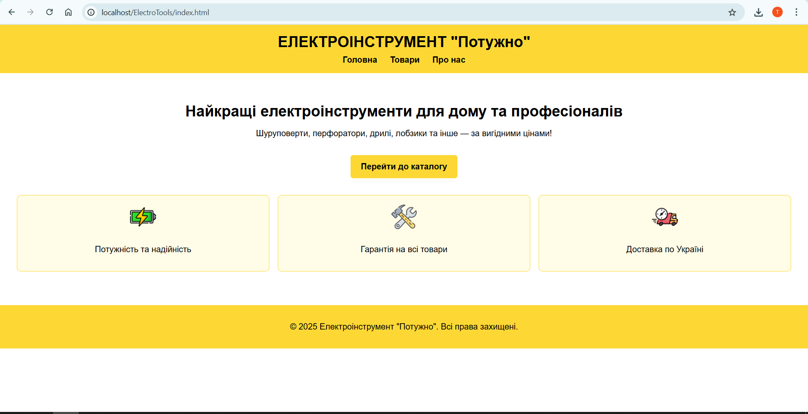
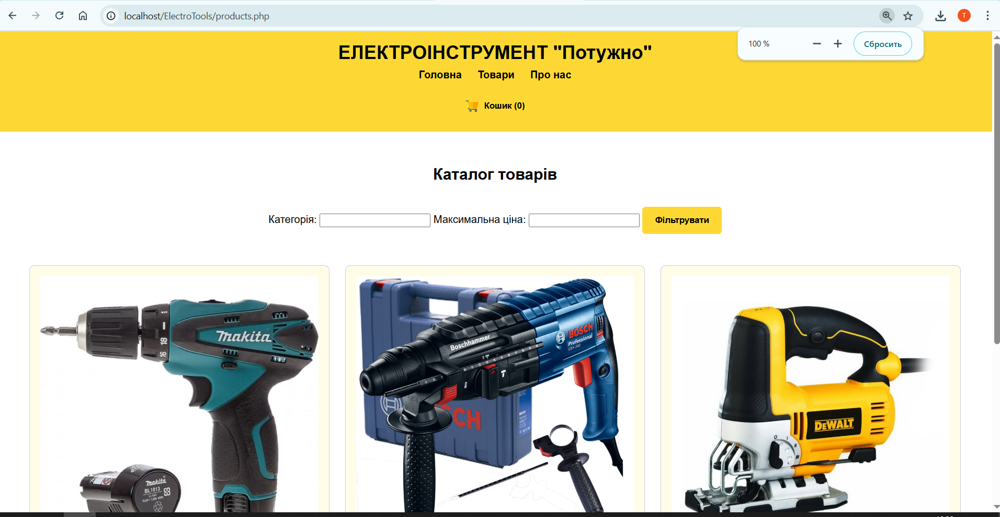
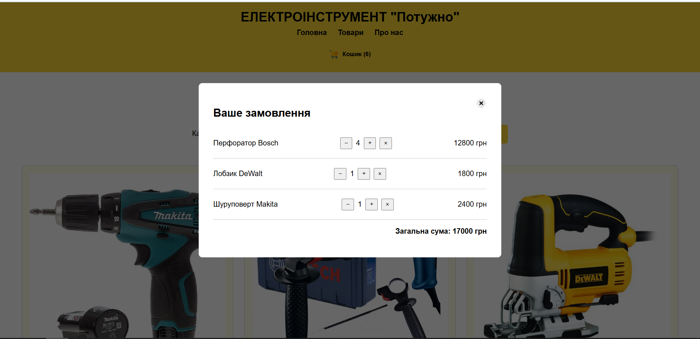
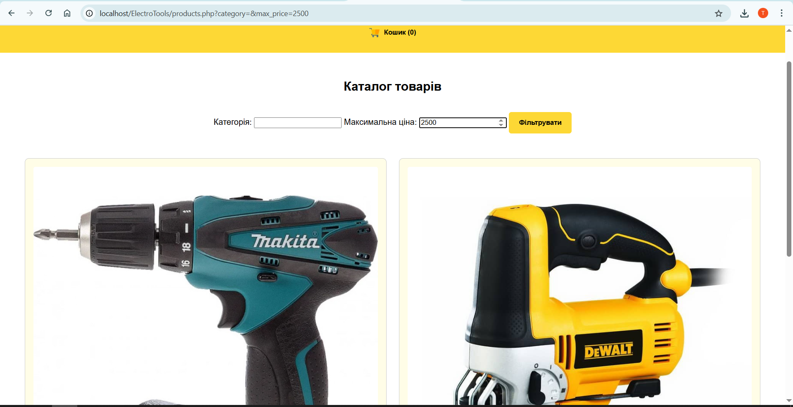
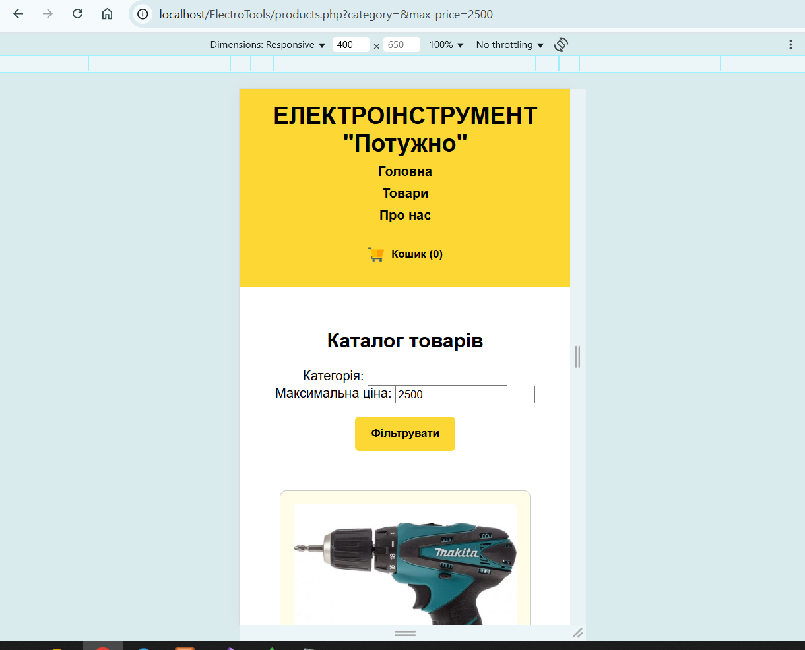
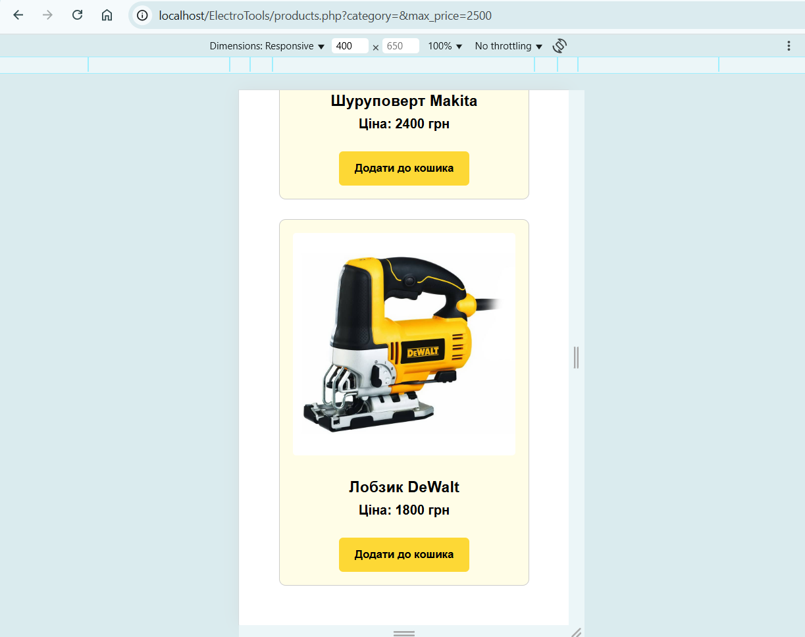
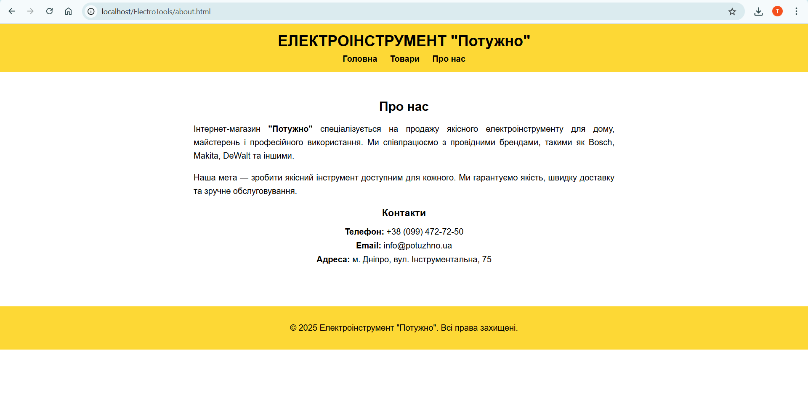
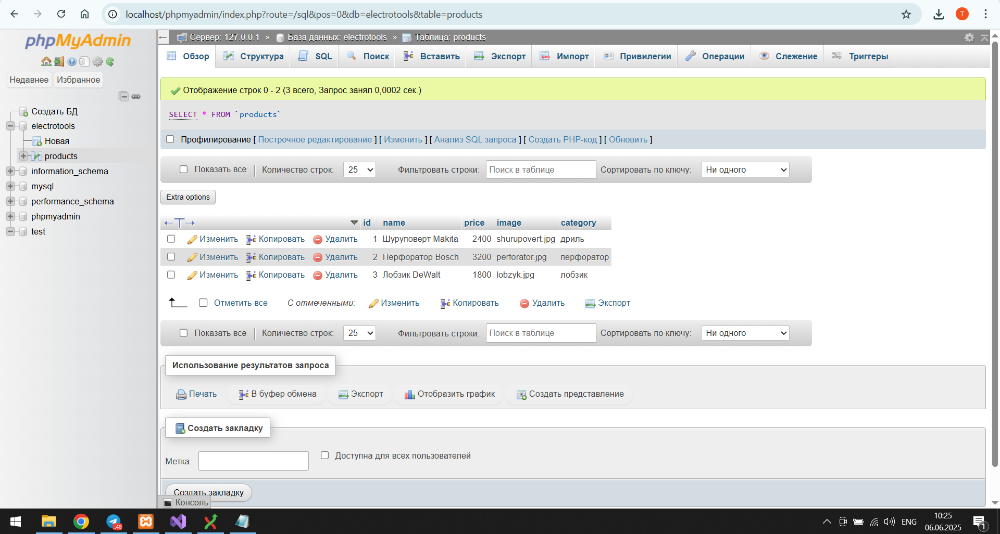

# Електроінструмент "Потужно"

Це статичний сайт для умовного магазину електроінструментів під назвою "Потужно". Проєкт реалізовано в рамках навчального завдання з веб-технологій.

Сторінки:

- Головна — `index.html`: короткий опис, навігація, переваги.

- Каталог товарів — `products.html`: список інструментів у форматі Grid.

- Про нас — `about.html`: загальна інформація, контакти.

Особливості

- Адаптивна верстка (CSS Grid + медіа-запити)
- Стиль: білий фон, жовті елементи, чорний текст
- Локальні зображення для товарів та іконок
- HTML + CSS без сторонніх бібліотек
- Структурований, чистий код
- Репозиторій ініціалізовано з однією гілкою `main`
- PHP — отримання та фільтрація товарів з бази даних
- MySQL — зберігання товарів у таблиці `products`, фільтрація за категорією та ціною

